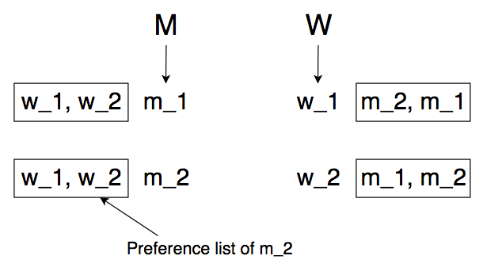
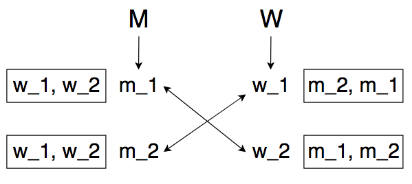
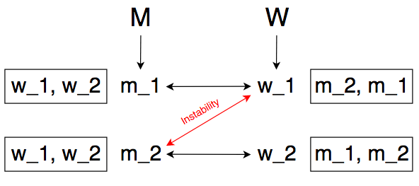

# Chapter 1: Introduction - Some Representative Problems

---

## 1.1 A First Problem: Stable Matching

### What is the Stable Matching/Marriage Problem?

* One way to represent the **Stable Marriage Problem (SMP)** is to use a group of men and a group of women, who are all looking to get married to someone of the opposite gender.
  * Let `M` be the set of all men, and `W` be the set of all women.
    * Both groups have size `N`.
    * Let `M x W` denote the set of all possible ordered pairs of the form `(m,w)`, where `m ∈ M` and `w ∈ W`. 
    * A **matching set** is a set of ordered pairs, each from `M x W`, with the property that each member of `M` and each member of `W` appears in at *most* one pair.
    * A **perfect matching** is a matching set with the property that each man and each woman appears in *exactly* one pair.
  * Each person has a **preference list** that ranks all members of the opposite sex - the first person on their list is the person they'd most like to be married to, and the last person on their list is the person they'd least like to be married to.
    * We say that `m` prefers some woman `w` to another woman `w'` if and only if `w` ranks higher than `w'` on his preference list.
  * We want to create a solution set `S` where `S` is a set of pairs of married men and women, such that no two people would prefer eachother over their current partners (i.e., the solution is **stable**).
* Here is one instance of the problem:
  * Let `M = {m_1, m_2}` and `W = {w_1, w_2}`.
    * Let the preference list of `m_1` be `[w_1, w_2]`. 
    * Let the preference list of `m_2` be `[w_1, w_2]`. 
    * Let the preference list of `w_1` be `[m_2, m_1]`. 
    * Let the preference list of `w_2` be `[m_1, m_2]`.



* In this problem, a **stable matching** would be the set `S = { (m_1, w_2) , (m_2, w_1) }`. In this matching, no two people would both prefer eachother to their partner.

  * Note that even though `m_1` is unhappy and would rather be with `w_1` than `w_2`, the solution is still stable because `w_2` would not leave `m_2` for `m_1`.
  * This stable matching can be drawn like below:

  


* An **unstable matching** would be the set `S = { (m_1, w_1) , (m_2, w_2) }`. In this matching, `m_2` and `w_1` would both prefer to be with eachother over their designated partners.




### Designing the Gale-Shapley Algorithm

* The **Gale-Shapley (GS)** algorithm, is an algorithm to find a stable matching given a set of men, a set of women, and the preference lists for every man and woman.

* The algorithm involves men proposing to women one by one - if a woman has no match, or prefers the proposing man to her current man, then she will become **engaged** to him. 

  * They aren't married yet; another man may later propose to her whom she prefers to her current man.

* The GS algorithm is as follows:

  ```
  * Initially all m ∈ M and w ∈ W are free.
  * While there is a man m who is free:
  	* Choose such a man m.
  	* Let w be the highest-ranked woman in m's preference list to whom he has not yet proposed.
  	* If w is free, then:
  		* (m,w) become engaged.
  		* m and w are both removed from the set of free men and women.
  	* Else w is currently engaged to m' : 
  		* If w prefers m' to m then:
  			* m remains free.
  		* Else w prefers m to m' :
  			* (m,w become engaged).
  			* m and w are both removed from the set of free men and women.
  			* m' becomes free.
  	
  * Return the set S of engaged pairs.
  ```

* One property of the GS algorithm, is that it terminates after *at most* `n^2` iterations of the `While` loop (i.e., **the algorithm has worst-case runtime `O(n^2)`**).

  * When proving the **upper-bound runtimes** of algorithms, a useful strategy is to find a measure of *progress*. 
    * By progress, we maen we want some precise way of saying that each step taken by the algorithm *must* bring it closer to termination.
  * In the case of the GS algorithm, each iteration consists of some man proposing (for the only time) to a woman he hasn't proposed to before.
    * If we let `P(t)` denote the set of pairs `(m,w)` such that `m` has proposed to `w` by the end of iteration `t`, we see that for all `t`, the size of `P(t + 1)` is strictly greater than the size of `P(t)`, since a new proposal is added.
    * Since there are only `n^2` possible pairs of men and women in total, the size of `P(t)` can be at most `n^2` (i.e. every man has proposed to every woman).
    * It follows that there can only be at most `n^2` iterations.


### Extensions of the Gale-Shapley Algorithm

* Given a stable matching problem, there can be multiple different solution sets, where people have different partners but the solution is still stable.

* In some sense, the Gale-Shapley algorithm is **unfair**, because it favors the group that is doing the proposing over the group that is being proposed to.

  * For example, consider the instance where every man has a different woman at the top of his preference list.
    * In this case, every man will propose and be engaged to his first-choice of woman, and no man will ever become un-engaged as no two men will choose to propose to the same woman.
    * If this is the case, every woman's preference list is irrelevant - they could even ALL be matched with the man at the bottom of their preference list and it would still result in a stable matching.

* Another key property of the Gale-Shapley algorithm is that **all executions yield the same matching set**, given that the same group of people is proposing.

* The algorithm can be further analyzed in terms of **valid partners**.

  * A woman `w` is a *valid partner* of a man `m` if there is a stable matching that contains the pair `(m,w)`. 

  * We can say that `w` is the *best valid partner* of `m` if `w` is a valid partner of `m`, and no woman who `m` prefers over `w` is a valid partner of his.

    * i.e. of all possible solution sets, `w` is the best woman he is paired with in any of them.

  * This gives us the properties:

    >1. In a stable matching by the GS algorithm, each man is paired with his *best* valid partner.
    >2. In a stable matching by the GS algorithm, each woman is paired with her *worst* valid partner.

---

## 1.2 Five Representative Problems

### 1: Interval Scheduling

TODO