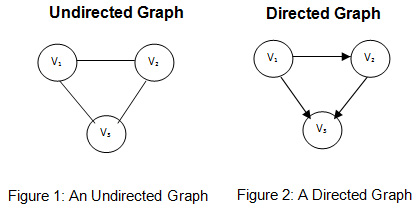

# Chapter 3: Graphs

---

## 3.1 Basic Definitions and Applications

####What are graphs?

* A graph consists of a collection `V` of **vertices**(or **nodes**), and a collection `E` of **edges**. 

* Each edge connects two nodes, either in one direction or two directions.
  * A graph that goes in both directions is called an **undirected** (or **symmetric**) graph.
  * If a graph goes in one direction, it is called a **directed** (or **asymmetric**) graph.
    * A directed graph `G'` consists of a set of nodes `V` and a set of **directed edges** `E'`.
      * Every `e' ∈ E'` is an **ordered pair** `(u,v)`, where `u` is called the tail of the edge, and v is the head.
      * The edge `e'` *leaves* node `u` and *enters* node `v`. 

* We can represent an edge `e ∈ E` as a two-element subset of `V: e = {u, v}`.
  * `u` and `v` are two nodes connected by `e`. `u` and `v` are also called the `ends` of `e`.

  ​

#### Paths and Connectivity in Graphs

* A **path** in an *undirected* graph `G = (V,E)` (where V = set of all vertices, and E = set of all edges) is a sequence `P` of nodes `v_1, v_2, ... v_k` where every consecutive pair `v_i`, `v_i+1` is joined by an edge. 

* For example, in the picture below, `3,2,1,7,9` forms a path, whereas `3,4,6` does not.

  

* A path in a *directed* graph is slightly different - there can be a path from node `u` to node `v` but not from `v` to `u`.

  * A directed graph is called **strongly connected** if every path is reversible; that is, for any two nodes `a`, `b` in the graph, there is a path from `a` to `b` and from `b` to `a`.

* The **distance** between two nodes `u` and `v` is the minimum number of edges in a path connecting `u` and `v`.

* An undirected graph is a **tree** if it is connected and doesn't contain a cycle.

  * This means that removing any edge in the graph will disconnect it.

  * Facts about trees:

    > * Every tree with `n` nodes has exactly `n - 1` edges.
    > * If `G` is an undirected graph of `n` nodes, then any of the two following statements being true implies that the third is also true:
    >   1. `G` is connected.
    >   2. `G` does not contain a cycle.
    >   3. `G` has `n - 1` edges.

---

## 3.2 Graph Connectivity and Graph Traversal

####What is graph connectivity?

* Given a graph `G` and two nodes `s` and `t`, we want to find an algorithm to efficiently determine if there is a path from `s` to `t`. This is called the problem of determining **`s-t` connectivity**

#### Breadth-first search

* **Breadth-first search (BFS)** is an algorithm in which we explore outward from `s` in all possible directions, visiting nodes in order of distance, i.e. in **layers**. 

  * The layers `L_1, L_2, L_3` can be defined precisely:

    > * Layer `L_0`: this layer is sometimes used to denote `s` itself.
    > * Layer `L_1`: consists of all nodes that are neighbors of `s`. 
    > * Assuming we have defined layers `L_1,...,L_j`, then layer `L_j+1` consists of all nodes that don't belong to an earlier layer, and are connected to a node in layer `L_j`.

    * This also means that layer `L_k` consists of all nodes that are at distance `k` from `s`. 

* The BFS algorithm returns a set of nodes that are reachable from the starting node `s`. 

  * This set `R` is referred to to as the **connected component** of `G` containing `s`.
  * ​