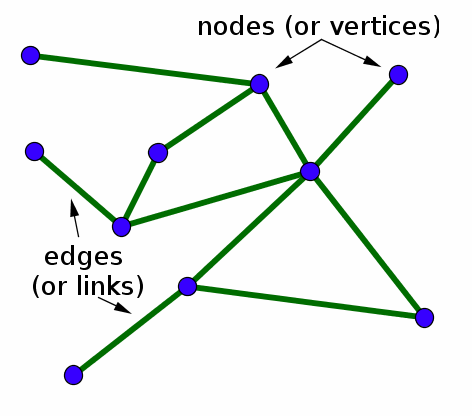
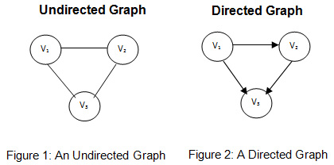
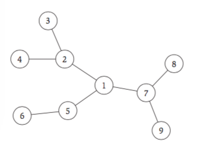
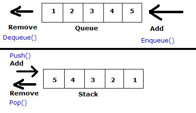
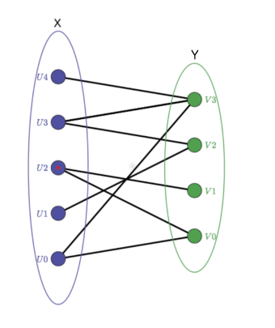

# Chapter 3: Graphs

---

## 3.1 Basic Definitions and Applications

### What are graphs?

* A graph consists of a collection `V` of **vertices**(or **nodes**), and a collection `E` of **edges**. 




* Each edge connects two nodes, either in one direction or two directions.
  * A graph that goes in both directions is called an **undirected** (or **symmetric**) graph.
  * If a graph goes in one direction, it is called a **directed** (or **asymmetric**) graph.
    * A directed graph `G'` consists of a set of nodes `V` and a set of **directed edges** `E'`.
      * Every `e' ∈ E'` is an **ordered pair** `(u,v)`, where `u` is called the tail of the edge, and v is the head.
      * The edge `e'` *leaves* node `u` and *enters* node `v`. 




* We can represent an edge `e ∈ E` as a two-element subset of `V: e = {u, v}`.
  * `u` and `v` are two nodes connected by `e`. `u` and `v` are also called the **ends** of `e`.

  ​


### Paths and Connectivity in Graphs

* A **path** in an *undirected* graph `G = (V,E)` (where `V` = set of all vertices, and `E` = set of all edges) is a sequence `P` of nodes `v_1, v_2, ... v_k` where every consecutive pair `v_i`, `v_i+1` is joined by an edge. 

* For example, in the picture below, `3,2,1,7,9` forms a path, whereas `3,4,6` does not.

  


* A path in a *directed* graph is slightly different - there can be a path from node `u` to node `v` but not from `v` to `u`.

  * A directed graph is called **strongly connected** if every path is reversible; that is, for any two nodes `u`, `v` in the graph, there is a path from `u` to `v` and from `v` to `u`.

* The **distance** between two nodes `u` and `v` is the minimum number of edges in a path connecting `u` and `v`.

* An undirected graph is a **tree** if it is connected and doesn't contain a cycle.

  * This means that removing any edge in the graph will disconnect it.

  * Facts about trees:

    > * Every tree with `n` nodes has exactly `n - 1` edges.
    > * If `G` is an undirected graph of `n` nodes, then any of the two following statements being true implies that the third is also true:
    >   1. `G` is connected.
    >   2. `G` does not contain a cycle.
    >   3. `G` has `n - 1` edges.

---

## 3.2 Graph Connectivity and Graph Traversal

### What is graph connectivity?

* The **degree** of a node `v` is the number of nodes that `v` is adjacent to (i.e. the number of edges from `v` to other nodes in the graph).
* Given a graph `G` and two nodes `s` and `t`, we want to find an algorithm to efficiently determine if there is a path from `s` to `t`. This is called the problem of determining **`s-t` connectivity**


### Breadth-first search

* **Breadth-first search (BFS)** is an algorithm in which we explore outward from `s` in all possible directions, visiting nodes in order of distance, i.e. in **layers**. 

  * The layers `L_1, L_2, L_3` can be defined precisely:

    > * Layer `L_0`: this layer is sometimes used to denote `s` itself.
    > * Layer `L_1`: consists of all nodes that are neighbors of `s`. 
    > * Assuming we have defined layers `L_1,...,L_j`, then layer `L_j+1` consists of all nodes that don't belong to an earlier layer, and are connected to a node in layer `L_j`.

    * This also means that layer `L_k` consists of all nodes that are at distance `k` from `s`. 

* The BFS algorithm returns a set of nodes that are reachable from the starting node `s`. 

  * This set `R` is referred to to as the **connected component** of `G` containing `s`.

  ​

### Depth-first search

* **Depth-first search** involves repeatedly following the first unseen edge you find, until you reach a dead-end, at which point you backtrack and try again from another unseen edge (imagine finding your way through a maze, when you reach a dead-end you go back and try the closest path you haven't been through yet).

* The DFS algorithm is as follows:

  ```
  DFS(u):
  	* Mark u as "Explored" and add u to R.
  	* For each edge (u,v) incident to u:
  		* If v is not marked "Explored" then:
  			* Recursively invoke DFS(v)
  ```

---

## 3.3 Implementing Graph Traversal Using Queues and Stacks

* The primary difference between implementing the BFS and DFS algorithms, is that BFS uses a **queue** to store the nodes to be visited, whereas DFS uses a **stack**.


### Representing Graphs

* Graphs can either be represented using an **adjacency matrix** or an **adjacency list**.
* Consider a graph `G = (V,E)`. Let `n = |V|` (the number of nodes), and let `m = |E|`, (the number of edges).
* A connected graph must have at least `m >= n - 1` edges. 
* Running times will be given in terms of `n` and `m`.
  * However, this can make things unclear; for example, is `O(m^2)` a better runtime than `O(n^3)`? It depends on what the actual values are for `m` and `n`.
  * For this reason, running times will generally be denoted in terms of both `m` and `n`.
    * For example, a *linear* runtime would be `O(m + n)`.

    ​


##### Adjacency Matrices

* Consider a graph `G = (V,E)` with `n` nodes, and assume the set of all nodes is `V = {1,…,n}`. 
  * The **adjacency matrix** of `G` is an `n x n` matrix `A` where `A[u,v] = 1` if the graph contains the edge `(u,v)` and `A[u,v] = 0` if it does not.
  * The adjacency matrix allows us to check in **`O(1)` time** if a given edge `(u,v)` is in the graph.
  * However, it has two basic disadvantages:
    1. The representation takes **`θ(n^2)` space**. If the graph has few edges, then a lot of space is wasted containing zeroes.
    2. Checking all edges incident to a given node `v` involves checking `A[v,w]` for every single other node `w` in the graph, which takes **`θ(n)` time**. 

    ​


##### Adjacency Lists

* In an **adjacency list**, for every node `v` there is a list of nodes `L` which contains all nodes that share an edge with `v`.
  * More precisely, there is an array of lists `Adj`, where `Adj[v]` is a list of all nodes adjacent to node `v`. 
  * For an undirected graph, each edge `e = (v,w)`, `Adj[v]` contains `w`, and `Adj[w]` contains `v`.
* Adjacency lists are better for **sparse graphs** - graphs that haven many fewer than `n^2` edges.


##### Comparing adjacency lists and adjacency matrices

* An adjacency matrix requires `O(n^2)` space, whereas the adjacency list requires `O(m + n)` space. This means that an adjacency list representation performs much better when the number of edges `m` is small relative to the number of nodes`n`. 
* Checking whether an edge `e = (u,v)` is in an adjacency matrix takes `O(1)` time, whereas checking whether `e` is in an adjacency list takes `O(n_u)` time, where `n_u` is the *degree* of node `u`. 


### Queues and Stacks

* A **queue** is a set from which elements are removed in a **first in, first out (FIFO)** order - elements are removed in the same order that they were added.

* A **stack** is a set from which elements are removed in a **last in, first out (LIFO)** order - the most recently added element is removed first.

  

* Both stacks and queues can easily be implemented using a *doubly linked list*.


### Implementing Breadth-First Search

* BFS can be implemented using an *adjacency list*.

* When scanning the edges leaving node `u` and come to an edge `e = (u,v)`, we must check whether or not `v` has already been seen by the search.

  * To do this, we have an array called `Discovered` of length `n` and set `Discovered[v] = true` when we first encounter node `v`.

* The algorithm constructs layers of nodes `L_1, L_2,…` where `L_i` is the set of nodes at distance `i` from the source `s`. To maintain the nodes in a layer `L_i`, we have a list `L[i]` for each `i = 0,1,2,…`.

* The **BFS algorithm** is as follows:

  ```
  BFS(s):
  	* Initialize Discovered[s] = true and Discovered[v] = false for all other v.
  	* Initialize L[0] to consist of the single element s.
  	* Set the layer counter i = 0.
  	* Set the current BFS tree T = ∅.
  	* While L[i] is not empty:
  		* Initialize an empty list L[i + 1].
  		* For each node u in L[i]:
  			* Consider each edge (u,v) incident to u.
  			* If Discovered[v] = false, then:
  				* Set Discovered[v] = true.
  				* Add edge (u,v) to the tree T.
  				* Add v to the list L[i + 1].
  		* Increment the layer counter by 1. 
  ```


* This implementation runs in linear time `O(m + n)` if the graph is given in adjacency list representation.


### Implementing Depth-First Search

* The **DFS algorithm** is as follows:

  ```
  DFS(s):
  	* Initalize S to be a stack with one element s.
  	* While S is not empty:
  		* Take a node u from S.
  		* If Explored[u] = false, then:
  			* Set Explored[u] = true.
  			* For each edge (u,v) incident to u:
  				* Add v to the stack S.
  ```

* If we want the algorithm to also find the *DFS tree*, we need to have each node `u` on the stack `S` maintain the node that "caused" u to get added to the stack.

  * This can be done using an array called `parent` and setting `parent[v] = u` when we add node `v` to the stack due to the edge `(u,v)`. 
  * When we mark a node `u != s` as `Explored`, we can also add the edge `(u, parent[u])` to the tree `T`.

* The main step of the algorithm is to add and delete nodes to and from the stack `S`, which both take `O(1)` time. 

  * Thus to bound the running time, we need to find the number of nodes that can be added to `S`.
    * Let `n_v` denote the degree of node `v`. Node `v` will get added to the stack `S` every time one of its `n_v` adjacent nodes is explored, so the total number of nodes added to `S` is at most `2m `(don't ask me where this number comes from, I have no clue ¯\\\_(ツ)_/¯ ).
    * This proves the bound on the runtime of DFS is `O(m + n)`.

  ​


### Finding the Set of All Connected Components

* If a graph is disconnected, then the connected component generated by using a DFS on node `s` will not cover the entire graph.
* To find the set of all connected components of a graph `G`:
  1. Start with an arbitrary node s, and use BFS or DFS to generate its connected component.
  2. Then find a node `v` (if any) that was not visited by the search from `s`, and use BFS or DFS to generate its connected component, which will be disjoint from the component of `s`.
  3. Continue until all nodes have been visited.

---

## 3.4 Testing Bipartiteness: An Application of Breadth-First Search

* a **bipartite graph** is one where the node set `V` can be partitioned into sets `X` and `Y` in such a way that every edge has one end in `X` and the  other end in `Y`.

  

* We could also define bipartiteness in terms of colours: for example, all nodes in `X` are coloured purple, and all nodes in `Y` are green. 

  * Then, the graph is bipartite if every edge in the graph has one purple end and one green end.

* If a graph `G` is bipartite, then it cannot contain an odd cycle (i.e., a cycle containing 3, 5, 7,… nodes).


### Checking for Bipartiteness

* The algorithm to test a graph for bipartiteness can also be written in terms of colour:
  1. Assume that graph `G` is connected. If it is not, we can perform the algorithm separately on each connected component.
  2. Pick a node `s` from the set of all nodes `V` and colour it red.
  3. Colour all neighbour nodes of `s` blue.
  4. For each of those neighbour nodes, colour their neighbour nodes red.
  5. Continue this process until the entire graph is covered. 
  6. At this point, either we have a valid red/blue colouring of `G`, in which every edge has ends of opposite colours, or there is some edge with ends of the same colour.
* This algorithm is essentially identical to BFS, where all even layers are coloured red, and all odd layers are coloured blue.
  * That means that this algorithm can easily be implemented on top of the BFS algorithm, by adding an extra `Color` array to keep keep track of the color of each node.
    * Whenever we get to a step in BFS where we are adding a node `v` to a list `L[i + 1]`, we assign `Color[v] = red` if `i + 1` is an even number, and `Color[v] = blue` otherwise.
    * Thus the total runtime for the coloring algorithm is `O(m + n)`.

---

## 3.5 Connectivity in Directed Graphs

### Representing Directed Graphs

* We can represent directed graphs using a version of the adjacency list representation:
  * Instead of each node having a single list of neighbours, each node has two lists associated with it:
    1. The list of nodes *to which* it has edges.
    2. The list of nodes *from which* it has edges.


### The Graph Search Algorithms

* The breadth-first search and depth-first search algorithms are nearly identical for directed graphs, except that when adding new nodes to the list of nodes to visit, we consider nodes with an edge going from the current node to another node.
* Supposed that for a given node `s`, we wanted the set of nodes with paths to `s`, rather than the set of nodes with paths from `s`. 
  * This can be done easily by creating a new directed graph, `G_rev`, which is obtained by reversing the direction of every edge in `G`. 
  * We could then run BFS or DFS on `G_rev`; then a node ahs a path *to* `s` in `G` if and only if it has a path *from* `s` in `G_rev`.


### Strong Connectivity

* A graph is **strongly connected** if, for every two nodes `u` and `v`, there is a path from `u` to `v` and also a path from `v` to `u`.

* We can also say that to nodes `u` and `v` in a directed graph are **mutually reachable** if there is a path from `u` to `v` and also a path from `v` to `u`. 

  * Thus, a graph is strongly connected if and only if every pair of nodes is mutually reachable.

  * Mutual reachability has the property:

    > If `u` and `v` are mutually reachable, and `v` and `w` are mutually reachable, then `u` and `w` are also mutually reachable.

* There is a linear-time algorithm to test if a directed graph is strongly connected:

  1. Pick any node `s` and run BFS in `G` starting from `s`. 
  2. We then also run `BFS` starting from `s` in `G_rev`. 
  3. If one of these two searches fails to reach every node, then `G` is not strongly connected.

* By analogy with connected components in an undirected graph, we can define the **strong** component containing a node `s` in a directed graph to be the set of all `v` such that `s` and `v` are mutually reachable.

  * From this, the property follows:

    > For any two nodes `s` and `t` in a directed graph, their strong components are either identical or disjoint.

  * It is possible to compute the strong components for all nodes in a total time of `O(m + n)`.

---

## 3.6 Directed Acyclic Graphs and Topological Ordering

TODO